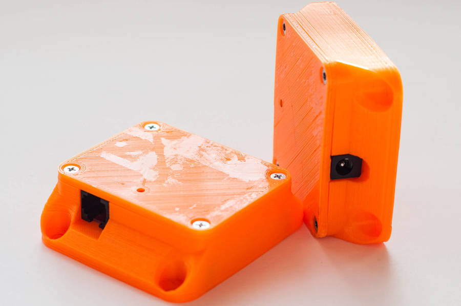

# ESP8266 node case

Design of 3D printable case for ESP8266 node.

## Features

 - Wall mountable with four screws
 - Dimensions: **TODO**
 - Closed with four M3 screws with flat head.

## About

This is part of [mqopen](http://mqopen.org/) project.
